# สถาปัตยกรรมข้อมูลใหม่ เรารับซื้อ.com V2 (New Information Architecture)

**โครงการ:** เรารับซื้อ.com V2 Strategy & IA Design  
**วันที่ปรับปรุงล่าสุด:** 19 สิงหาคม 2026  
**เอกสารอ้างอิง:** [`reports/seo/new-ia.csv`](file:///c:/Users/User/Desktop/รวมโปรเจค/werab-v2/reports/seo/new-ia.csv) และ [`reports/seo/v2-url-map.csv`](file:///c:/Users/User/Desktop/รวมโปรเจค/werab-v2/reports/seo/v2-url-map.csv)

---

## 1. ตำแหน่งทางการตลาดและจุดยืนเชิงกลยุทธ์ (Core Positioning)

เรารับซื้อ.com V2 ได้รับการออกแบบใหม่ทั้งหมดจาก **User Intent (เจตนาของผู้ค้นหา)** และ **Business Value (มูลค่าทางธุรกิจ)** โดยวางตำแหน่งเป็น:

> 🎯 **"GENERAL BUYBACK AUTHORITY — ผู้เชี่ยวชาญด้านการประเมินราคากลางและการรับซื้อสินค้าไอทีมือสอง"**  
> **แนวคิดหลักของเนื้อหาและบริการ:** *"ก่อนขาย เช็กราคา เข้าใจสภาพ แล้วค่อยตัดสินใจ"*

### 1.1 หน้าที่ของ `/เช็กราคาก่อนขาย/` (Valuation Intake / Decision Hub)
* **ไม่ใช่โปรแกรมคำนวณราคาอัตโนมัติ (NOT an automated price calculator):** เนื่องจากราคาสินค้าไอทีมือสองขึ้นอยู่กับรอยตำหนิ อุปกรณ์แท้ และความสมบูรณ์ของเมนบอร์ดจริง
* **บทบาทที่แท้จริง:** เป็นศูนย์กลาง **Valuation Intake & Consultation** ให้ข้อมูลเกณฑ์ราคากลาง, เช็กลิสต์ข้อมูลที่ต้องเตรียม, คำแนะนำวิธีถ่ายรูปส่งประเมิน, และเชื่อมต่อไปยังช่องทางประเมินราคาจริงผ่าน LINE Official / หน้าร้าน

---

## 2. โครงสร้างสถาปัตยกรรมข้อมูล V2 (Site Architecture Tree)

```mermaid
graph TD
    Root["/ (หน้าแรก เรารับซื้อ.com — Active INDEX)"]
    
    Root --> BuyHub["/รับซื้อ/ (ศูนย์รวมหมวดหมู่สินค้าไอที)"]
    Root --> PriceCheck["/เช็กราคาก่อนขาย/ (Valuation Intake & เกณฑ์ราคา)"]
    Root --> HowToSell["/วิธีขาย/ (ขั้นตอน นัดรับ และช่องทางขาย)"]
    Root --> About["/เกี่ยวกับ/ (นโยบายความโปร่งใส E-E-A-T)"]
    Root --> Contact["/ติดต่อ/ (จุดนัดรับ & LINE Official)"]
    Root --> Proof["/ผลงาน/ (หลักฐานความน่าเชื่อถือ & รีวิว)"]
    
    BuyHub --> NotebookHub["/รับซื้อโน๊ตบุ๊ค/"]
    BuyHub --> ComputerHub["/รับซื้อคอม/"]
    BuyHub --> MacHub["/รับซื้อแมคบุ๊ค/ (Canonical Hub)"]
    BuyHub --> iPhoneHub["/รับซื้อไอโฟน/"]
    BuyHub --> iPadHub["/รับซื้อไอแพด/"]
    BuyHub --> CameraHub["/รับซื้อกล้อง/"]
    BuyHub --> SpeakerHub["/รับซื้อลำโพง/"]
    BuyHub --> ScrapHub["/รับซื้อซากคอมพิวเตอร์/"]
    
    ScrapHub --> ServerHub["/รับซื้อ-server/"]
    
    PriceCheck --> CondScreen["/สภาพสินค้า/จอแตก/"]
    PriceCheck --> CondPower["/สภาพสินค้า/เปิดไม่ติด/"]
    PriceCheck --> CondBattery["/สภาพสินค้า/แบตเสื่อม/"]
    PriceCheck --> CondBox["/สภาพสินค้า/ไม่มีอุปกรณ์/"]
    PriceCheck --> CondRepair["/สภาพสินค้า/ควรซ่อมก่อนขายไหม/"]
    
    HowToSell --> GuideReset["/คู่มือ/วิธีล้างข้อมูล-factory-reset/"]
    HowToSell --> GuideSpecs["/คู่มือ/วิธีตรวจสเปกก่อนขาย/"]
    HowToSell --> GuidePhoto["/คู่มือ/วิธีถ่ายรูปประเมินราคา/"]
    
    NotebookHub --> LocalNB["15 Local Historical Notebook Winners"]
    ComputerHub --> LocalPC["3 Local Historical PC Winners"]
    iPhoneHub --> LocalPhone["5 Local Historical Phone Winners"]
    iPadHub --> LocalPad["2 Local Historical iPad Winners"]
    MacHub --> LocalMac["2 Local Historical Mac Winners"]
    CameraHub --> LocalCam["5 Local & Brand Camera Winners"]
    SpeakerHub --> LocalAudio["4 Local Audio Winners (2 Active INDEX)"]
```

---

## 3. เกณฑ์และระดับของหน้ารายพื้นที่ (Local Page Thresholds)

เพื่อป้องกันปัญหาหน้าบาง (Thin Content) หน้าพื้นที่ประวัติศาสตร์ทั้ง 36 หน้าถูกจำแนกออกเป็น 3 ระดับคุณภาพ:

| ระดับ (Tier) | เกณฑ์คัดเลือก (Criteria) | จำนวนหน้า | รายชื่อ URL ตัวแทน | แนวทางพัฒนาเนื้อหา |
| :--- | :--- | :---: | :--- | :--- |
| **`TIER_1_HIGH_EQUITY`** | Clicks (90d) ≥ 10, Pos ≤ 10, มีอุปสงค์สูงมาก | **15** | `/รับซื้อโน๊ตบุ๊คอุบล-notebook-laptop-จ/`, `/รับซื้อคอม-อุดรธานี/`, `/รับซื้อโทรศัพท์มือถือ-จ/`, `/รับซื้อโน๊ตบุ๊ค-บุรีรัม/`, `/รับซื้อโน๊ตบุ๊ค-เลย/`, `/รับซื้อ-notebook-อำเภอพล-ขอนแก่น/`, `/รับซื้อไอโฟน-มหาสารคาม/`, `/รับซื้อซากคอมพิวเตอร์/`, `/รับซื้อลำโพง-อุดรธานี/`, `/รับซื้อลำโพง-สารคาม/` ฯลฯ | ต้องมีจุดบริการทางกายภาพ แผนที่ และขั้นตอนนัดรับซื้อเฉพาะพื้นที่อย่างสมบูรณ์ |
| **`TIER_2_MODERATE_EQUITY`** | Clicks (90d) 4–9 หรือ Imp ≥ 100 | **15** | `/รับซื้อโน๊ตบุ๊ค-ขอนแก่น/`, `/รับซื้อ-notebook-ชุมแพ-ขอนแก่น/`, `/รับซื้อโน๊ตบุ๊ค-กาฬสินธ/`, `/รับซื้อคอม-สารคาม/`, `/รับซื้อไอโฟน-iphone-ร้อยเอ็ด/`, `/รับซื้อกล้องมือสองมุก/`, `/รับซื้อลำโพง-ร้อยเอ็ด-jbl-marshall/` ฯลฯ | ต้องระบุเส้นทางขนส่ง รัศมีเดินทาง และจุดรับซื้อสำคัญประจำอำเภอ |
| **`TIER_3_WEAK_BUT_STRATEGIC`** | Clicks 1–3 หรือตำแหน่งเชิงยุทธศาสตร์ | **6** | `/รับซื้อไอแพด-ขอนแก่น-ipad/`, `/รับซื้อไอแพด-ยโสธร-ipad/`, `/รับซื้อกล้องมือสองสุร/`, `/รับซื้อลำโพง-ยโสธร/` | ต้องมีข้อมูลจำเพาะของสินค้าร่วมกับข้อมูลการนัดรับท้องถิ่น (ห้ามสปินคำ) |

---

## 4. ยอดรวมที่ผ่านการกระทบยอดทางสถิติ 100% (Reconciled Deduplicated Summary)

### ตารางตรวจสอบความสอดคล้องของจำนวนหน้า (Arithmetic Check)

| รหัสบทบาทของหน้า (Page Role) | จำนวนหน้าเฉพาะ (Unique Count) | สถานะความปลอดภัยปัจจุบัน |
| :--- | :---: | :--- |
| **`HOME`** | **1** | **Active INDEX (200)** |
| **`MONEY_HUB`** | **10** | HOLD_NOINDEX (200) |
| **`MODEL_MONEY`** | **1** | HOLD_NOINDEX (200) |
| **`LOCAL_MONEY`** | **36** | 2 Active INDEX + 34 HOLD_NOINDEX |
| **`CONDITION_GUIDE`** | **3** | HOLD_NOINDEX (200) |
| **`VALUATION_GUIDE`** | **3** | HOLD_NOINDEX (200) |
| **`HOW_TO`** | **4** | HOLD_NOINDEX (200) |
| **`TRUST`** | **3** | HOLD_NOINDEX (200) |
| **ยอดรวมหน้าในแผน IA ทั้งหมด (Total Unique Pages)** | **61** | **3 Active INDEX + 58 HOLD_NOINDEX** |

* **ความคลาดเคลื่อนทางคณิตศาสตร์ / หน้าซ้ำซ้อน (Duplicate Errors):** **0**
* **Active INDEX ในรันไทม์ปัจจุบัน:** **3 หน้า** (คงเดิม ไม่เปลี่ยนแปลง)
* **Unapproved Thin INDEX:** **0 หน้า**
